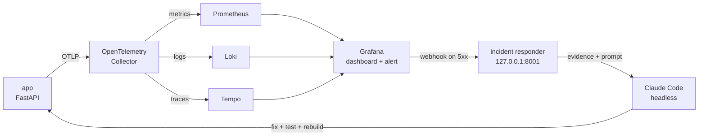

# Order Tracker

This is a homework project repo for the [AI Dev Tools Zoomcamp](https://github.com/DataTalksClub/ai-dev-tools-zoomcamp/tree/main) (2026 cohort) from [DataTalks.Club](https://datatalks.club/).
Initially, it was forked from alexeygrigorev/order-tracker for module 4 homework.
Then the homework was implemented.

## Starter (as forked from the instructor)

### Description
A small order tracking app for the AI Dev Tools Zoomcamp observability homework. It includes a web page, API, tests, and a Docker Compose setup. You add telemetry, alerts, and an incident responder in Homework 4.

The main user flow is creating an order and checking its status. Three sample orders are created on first startup.

### Run it

You need Docker with Compose. To run the tests, you also need Python 3.11+ and `uv`.

```bash
docker compose up --build -d --wait
```

Open <http://127.0.0.1:8000>. The API is at `/api/orders`, and the health check is at `/healthz`. Data is stored in a Docker volume and survives container recreation.

If port 8000 is occupied, set `ORDER_TRACKER_PORT`, for example:

```bash
ORDER_TRACKER_PORT=18080 docker compose up --build -d --wait
```

Run tests with `uv run --frozen pytest -q`. Stop the app with `docker compose down`. Add `-v` only if you also want to delete the order data.

### API

| Method | Path | Purpose |
| --- | --- | --- |
| GET | `/` | Web page |
| GET | `/healthz` | Database health check |
| GET | `/api/orders` | List orders |
| POST | `/api/orders` | Create an order |
| GET | `/api/orders/{id}` | Check an order |
| PATCH | `/api/orders/{id}` | Change an order status |

The app uses SQLite to keep setup small. Run one app container at a time. The course exercise is about detecting and handling an incident, not scaling the database.

## Status after completion of homework 4 (HW4)

The app now reports metrics, logs and traces, stores them in an observability stack, alerts on server errors, and hands each alert to a headless coding agent that investigates and fixes the cause. All six homework questions are done; the incident below was found and fixed by that agent.

### What was added



| Path | Purpose |
| --- | --- |
| `app/telemetry.py` | OpenTelemetry setup. Order lookups produce a span, a log line with the same `trace_id`, and a request counter labelled by route template and status code; crashes count as 500. |
| `observability/` | Collector, Prometheus, Loki and Tempo config; Grafana data sources, the *Order Tracker* dashboard, the 5xx alert rule and the webhook, all provisioned from files. |
| `incident-response/responder.py` | `POST /alerts` on `127.0.0.1:8001`. Saves the alert and a read-only evidence packet (metrics, error logs, error traces), then runs Claude Code headless. One run at a time. |
| `incident-response/agent-settings.json` | The agent's tool allowlist: read the repo, edit `app/` and `tests/`, run tests, rebuild the app, query it with `curl`. Everything else is refused, including `git commit` and `git push`. |
| `incident-response/incidents/` | One folder per alert: alert, evidence, prompt, the agent's answer, and run metadata (turns, duration, cost, refused tool calls). |

### Run it

```bash
docker compose up --build -d --wait               # app + observability stack
uv run python incident-response/responder.py      # responder, in a second terminal
```

Grafana is at <http://localhost:3000> (no login; bound to localhost only). The responder needs the `claude` CLI installed and signed in.

### The incident

`GET /api/orders/express-1002` returned 500. The alert fired, the responder collected the `ValueError: day is out of range for month` log with its trace, and the agent traced it to the express delivery estimate: `placed_at.replace(day=placed_at.day + 2)` fails for orders placed in the last two days of a month. It replaced it with `placed_at + timedelta(days=2)`, added a regression test, and rebuilt the app. The fix was reviewed and committed by hand. Evidence: `incident-response/incidents/20260928-181330-order-lookup-returns-5xx/`.

### Limits

This is a local proof of concept, not a production setup: no authentication on Grafana or the responder (both are bound to localhost), and the agent runs on the host with the user's permissions, bounded only by its allowlist.
